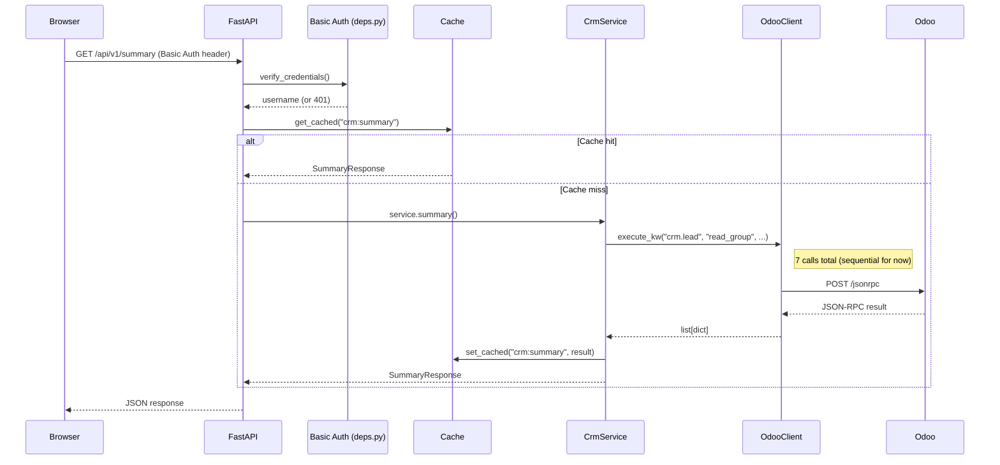

# Architecture — CRM AI Engine v2.0

## Overview

CRM AI Engine is a **read-only** FastAPI application that queries Odoo CRM via JSON-RPC
and presents a management dashboard for Sales Managers, Sales Employees, and Top Management.

It is designed to grow into a multi-module Real Estate ERP intelligence layer
(Inventory, Sales, Finance, Marketing), so the architecture is modular from day one.

---

## Layer Diagram

```
┌─────────────────────────────────────────────────────────┐
│                      HTTP Clients                        │
│              (Browsers / API consumers)                  │
└────────────────────────┬────────────────────────────────┘
                         │
┌────────────────────────▼────────────────────────────────┐
│                   FastAPI (main.py)                      │
│  ┌─────────────┐  ┌──────────────┐  ┌────────────────┐  │
│  │  Middleware  │  │  Exception   │  │    Lifespan    │  │
│  │ (Request ID) │  │  Handlers    │  │ (init cache,   │  │
│  └─────────────┘  └──────────────┘  │  create svc)   │  │
│                                     └────────────────┘  │
└────────────────────────┬────────────────────────────────┘
                         │
┌────────────────────────▼────────────────────────────────┐
│                   API Layer (api/)                       │
│  ┌──────────────┐  ┌─────────────────────────────────┐  │
│  │   deps.py    │  │   v1/endpoints/                 │  │
│  │ (auth, DI)   │  │   health / summary / followup   │  │
│  └──────────────┘  │   data_quality / dashboard      │  │
│                    └─────────────────────────────────┘  │
└────────────────────────┬────────────────────────────────┘
                         │
┌────────────────────────▼────────────────────────────────┐
│               Modules Layer (modules/)                   │
│  ┌─────────────────────────────────────────────────────┐ │
│  │  modules/crm/                                       │ │
│  │  ┌──────────┐ ┌──────────┐ ┌──────────────────────┐│ │
│  │  │ service  │ │ client   │ │  stage_resolver      ││ │
│  │  │(business │ │(httpx +  │ │  (stage ID→name,     ││ │
│  │  │ logic)   │ │ tenacity)│ │   1-hour cache)      ││ │
│  │  └──────────┘ └──────────┘ └──────────────────────┘│ │
│  │  ┌──────────┐ ┌──────────┐                          │ │
│  │  │ domain   │ │ schemas  │                          │ │
│  │  │(BASE_DOM │ │(Pydantic │                          │ │
│  │  │ stage IDs│ │ models)  │                          │ │
│  │  └──────────┘ └──────────┘                          │ │
│  └─────────────────────────────────────────────────────┘ │
└────────────────────────┬────────────────────────────────┘
                         │
┌────────────────────────▼────────────────────────────────┐
│               Core Layer (core/)                         │
│  config │ exceptions │ security │ cache │ logging        │
└────────────────────────┬────────────────────────────────┘
                         │
┌────────────────────────▼────────────────────────────────┐
│               Shared Layer (shared/)                     │
│  audit.py (writes logs/audit.log)                        │
└────────────────────────┬────────────────────────────────┘
                         │
┌────────────────────────▼────────────────────────────────┐
│                     Odoo JSON-RPC                        │
│  POST /jsonrpc  →  common.authenticate                   │
│                 →  object.execute_kw (read-only)         │
└─────────────────────────────────────────────────────────┘
```

---

## Request Flow



---

## Read-Only Enforcement

This is a **hard constraint**, not a configuration option.

```python
# backend/modules/crm/client.py

ALLOWED_METHODS: frozenset[str] = frozenset({
    "search_read", "read_group", "search_count",
    "search", "read", "fields_get", "name_search", "name_get",
})

def _ensure_read_only(method: str) -> None:
    if method not in ALLOWED_METHODS:
        raise ReadOnlyViolationError(...)
```

`_ensure_read_only()` is called at the top of `execute_kw()` **before** any network
activity or authentication. It is unit-tested for `create`, `write`, and `unlink`.

---

## Caching Strategy

| Key | Content | TTL |
|-----|---------|-----|
| `crm:summary` | Full summary (7 Odoo calls) | `CACHE_TTL_SECONDS` (default 60s) |
| `crm:followup_risk` | Overdue breakdowns | `CACHE_TTL_SECONDS` |
| `crm:missing_contact` | Missing contact list | `CACHE_TTL_SECONDS` |

Cache is in-memory (`cachetools.TTLCache`), thread-safe, and reset on app restart.
TTL is configurable via `CACHE_TTL_SECONDS` env var.

Stage names (from `crm.stage` model) are cached separately in `StageResolver`
with a 1-hour TTL.

---

## Stage ID Configuration

Stage IDs are Odoo database IDs that may differ between environments.
They are now configurable via environment variables:

```
CRM_CRITICAL_STAGE_IDS=28,34,35,37,41
CRM_CLOSED_EXCLUDED_STAGE_IDS=26,30,31,32,38,42,46
CRM_DATA_QUALITY_STAGE_IDS=44
```

The `Settings` model parses these into `list[int]` via `@property`.

**Known stage names for the current instance:**

| ID | Name | Group |
|----|------|-------|
| 26 | Closed Won | CLOSED_EXCLUDED |
| 28 | New Lead | CRITICAL |
| 30 | Closed Lost | CLOSED_EXCLUDED |
| 31 | Closed Duplicate | CLOSED_EXCLUDED |
| 32 | Closed Invalid | CLOSED_EXCLUDED |
| 34 | Qualified | CRITICAL |
| 35 | Proposal Sent | CRITICAL |
| 37 | Negotiation | CRITICAL |
| 38 | Closed No Answer | CLOSED_EXCLUDED |
| 41 | Contract Sent | CRITICAL |
| 42 | Closed Cancelled | CLOSED_EXCLUDED |
| 44 | New X | DATA_QUALITY |
| 46 | Closed Transferred | CLOSED_EXCLUDED |

---

## Adding a New Module (e.g., Inventory)

The architecture is designed to support new modules without touching existing code.

```
backend/modules/
└── inventory/               # new module
    ├── __init__.py
    ├── domain.py            # constants & BASE_DOMAIN
    ├── schemas.py           # Pydantic response models
    ├── client.py            # reuse OdooClient or subclass
    └── service.py           # business logic
```

Then in `backend/api/v1/`:

```python
# router.py
from backend.api.v1.endpoints import inventory
api_v1_router.include_router(inventory.router)
```

No changes to existing files required.

---

## API Versioning

| Route type | URL pattern | Auth |
|------------|------------|------|
| JSON API | `/api/v1/*` | Required (Basic Auth) |
| HTML UI | `/dashboard`, `/data-quality/*` | Required (Basic Auth) |
| Health check | `/health` | Not required |
| Legacy (redirects) | `/crm/*` → `/api/v1/*` | 301 redirect |
