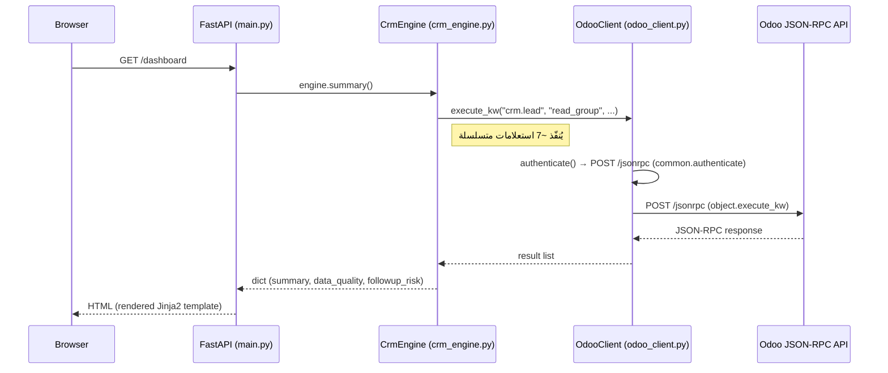

# Current State — CRM AI Engine

## نظرة عامة

**CRM AI Engine** هو تطبيق FastAPI يعمل كـ read-only dashboard يتصل بـ Odoo CRM عبر JSON-RPC.
هدفه الحالي عرض بيانات المتابعات المتأخرة وجودة البيانات للفرصات المحلولة (resolved opportunities) فقط.

- **الوضع الحالي:** Read-only، لا توجد عمليات كتابة على Odoo
- **النطاق:** resolved opportunities فقط (`opportunity_status = resolved`)
- **الاتصال بـ Odoo:** JSON-RPC مباشر عبر API Key

---

## الهيكل الحالي

```
CRM-AI-Engine/
├── backend/
│   ├── main.py          ← FastAPI app، تعريف الـ routes
│   ├── crm_engine.py    ← Business logic، الاستعلامات والتجميع
│   ├── odoo_client.py   ← JSON-RPC client للتواصل مع Odoo
│   └── config.py        ← قراءة env variables والتحقق منها
├── templates/
│   ├── dashboard.html         ← الـ dashboard الرئيسي (HTML/Jinja2)
│   └── missing_contact.html   ← صفحة تفاصيل البيانات الناقصة
├── requirements.txt     ← 5 dependencies بدون version pins
├── .gitignore           ← يستبعد .env فقط
└── .gitattributes       ← LF normalization
```

### وصف كل ملف

| الملف | الدور | ملاحظات |
|-------|-------|---------|
| `backend/main.py` | نقطة الدخول، تعريف 6 endpoints | يُنشئ `CrmEngine` في كل request |
| `backend/crm_engine.py` | كل الـ business logic | 10 methods، الـ stage IDs hardcoded |
| `backend/odoo_client.py` | JSON-RPC client | authenticate + execute_kw |
| `backend/config.py` | إدارة الـ config | يقرأ من `.env` عبر `python-dotenv` |
| `templates/dashboard.html` | واجهة المستخدم الرئيسية | Vanilla HTML + Inline CSS |
| `templates/missing_contact.html` | تفاصيل الاتصال الناقص | Vanilla HTML + Inline CSS مكرر |

---

## الـ Endpoints الموجودة

| Path | Method | Description | Response |
|------|--------|-------------|----------|
| `/` | GET | Health check | `{"ok": true, "service": "...", "mode": "read_only"}` |
| `/crm/summary` | GET | ملخص كامل للـ CRM | JSON: summary + data_quality + followup_risk |
| `/crm/followup-risk` | GET | تفاصيل المتابعات المتأخرة | JSON: overdue by salesperson/team/stage + matrix |
| `/crm/data-quality/missing-contact` | GET | بيانات الاتصال الناقصة (JSON) | JSON: قائمة من الـ opportunities |
| `/dashboard` | GET | الـ dashboard الرئيسي | HTML page (Jinja2 template) |
| `/data-quality/missing-contact` | GET | صفحة تفاصيل الاتصال الناقص | HTML page (Jinja2 template) |

---

## Data Flow



**تدفق المصادقة:**
```
.env vars → config.py → OdooClient.__init__ → authenticate() → uid
uid + api_key → execute_kw calls
```

---

## الـ Models المستخدمة من Odoo

| Model | الاستخدام | الطريقة |
|-------|-----------|---------|
| `crm.lead` | كل العمليات | `read_group` + `search_read` |

### الحقول المستخدمة من `crm.lead`

| الحقل | النوع | الاستخدام |
|-------|-------|-----------|
| `type` | selection | فلتر: `opportunity` فقط |
| `opportunity_status` | selection | فلتر: `resolved` فقط |
| `activity_state` | selection | overdue / planned / today / False |
| `stage_id` | many2one | التصنيف والفلترة |
| `user_id` | many2one | المندوب المسؤول |
| `team_id` | many2one | الفريق المسؤول |
| `name` | char | اسم الفرصة |
| `contact_name` | char | اسم جهة الاتصال |
| `source_id` | many2one | المصدر |
| `create_date` | datetime | تاريخ الإنشاء |
| `phone` | char | رقم الهاتف الأساسي |
| `mobile` | char | رقم الموبايل |
| `phone_one` → `phone_ten` | char | حقول هاتف مخصصة (custom fields) |
| `phone_note_ids` | one2many/char | ملاحظات الهاتف |

---

## الـ Stage IDs المستخدمة

### CRITICAL_STAGE_IDS = [28, 34, 35, 37, 41]
مراحل تُعتبر حرجة — المتابعات المتأخرة فيها تُحسب ضمن `critical_overdue`.

### CLOSED_EXCLUDED_STAGE_IDS = [26, 30, 31, 32, 38, 42, 46]
مراحل مغلقة أو مستبعدة — لا تُحسب ضمن الـ overdue followup risk.
(الفلسفة: لا يُتوقع نشاط على هذه المراحل)

> **تحذير:** الـ IDs مرتبطة بـ Odoo instance معين. لو تغيّرت البيئة، ستُصبح خاطئة.

---

## الـ Business Rules

### BASE_DOMAIN
```python
BASE_DOMAIN = [
    ["type", "=", "opportunity"],
    ["opportunity_status", "=", "resolved"],
]
```
**كل** الاستعلامات تبدأ بهذا الـ domain — الـ app يعمل فقط على resolved opportunities.

### Missing Contact Domain
```python
# BASE_DOMAIN +
["phone", "=", False],
["mobile", "=", False],
["phone_one", "=", False],
... (حتى phone_ten)
["phone_note_ids", "=", False],
```
يبحث عن فرصات لا يوجد بها أي رقم هاتف في أي من الحقول الـ 13.

### Overdue Followup Filter (followup_risk)
```python
BASE_DOMAIN + [
    ["activity_state", "=", "overdue"],
    ["stage_id", "not in", CLOSED_EXCLUDED_STAGE_IDS],
]
```
يستبعد المراحل المغلقة من حسابات المتأخرات.

### Critical Overdue Filter
```python
BASE_DOMAIN + [
    ["activity_state", "=", "overdue"],
    ["stage_id", "in", CRITICAL_STAGE_IDS],
]
```
يحصر العد في المراحل الحرجة فقط.

---

## Summary بالأرقام

| المقياس | القيمة |
|---------|--------|
| عدد الـ endpoints | 6 |
| عدد الملفات Python | 4 |
| عدد الـ templates | 2 |
| عدد الـ dependencies | 5 |
| عدد الـ Odoo models | 1 (crm.lead) |
| عدد الـ API calls لـ /dashboard | ~7 calls متسلسلة |
| حد سجلات missing_contact | 500 |
