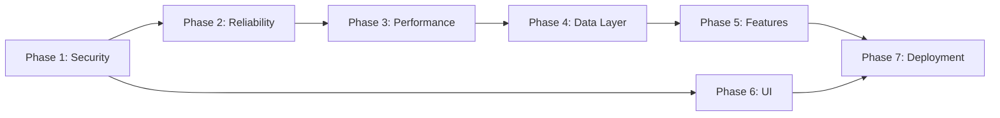

# Migration Plan — CRM AI Engine
# من MVP إلى Production-Grade

> تاريخ الخطة: 2026-05-10
> الوضع الحالي: MVP read-only dashboard
> الهدف: Production-grade CRM Intelligence Platform

---

## الـ Architecture المقترح

### الهيكل الجديد للمشروع

```
CRM-AI-Engine/
├── backend/
│   ├── __init__.py
│   ├── main.py                  ← FastAPI app + lifespan
│   ├── api/
│   │   ├── __init__.py
│   │   ├── routes/
│   │   │   ├── crm.py           ← CRM endpoints
│   │   │   ├── dashboard.py     ← Dashboard routes
│   │   │   └── health.py        ← Health check
│   │   └── deps.py              ← FastAPI dependencies (auth, engine)
│   ├── core/
│   │   ├── __init__.py
│   │   ├── config.py            ← Settings (Pydantic BaseSettings)
│   │   ├── security.py          ← Auth logic
│   │   └── logging.py           ← Structured logging setup
│   ├── services/
│   │   ├── __init__.py
│   │   ├── crm_engine.py        ← Business logic (async)
│   │   └── odoo_client.py       ← Async JSON-RPC client (httpx)
│   ├── models/
│   │   ├── __init__.py
│   │   ├── crm.py               ← Pydantic response models
│   │   └── config.py            ← Stage config models
│   └── cache/
│       ├── __init__.py
│       └── manager.py           ← Cache layer (TTL-based)
├── templates/
│   ├── base.html                ← Base template (shared CSS/JS)
│   ├── dashboard.html
│   └── missing_contact.html
├── static/
│   └── style.css                ← Shared CSS
├── tests/
│   ├── __init__.py
│   ├── conftest.py              ← pytest fixtures
│   ├── unit/
│   │   ├── test_crm_engine.py
│   │   └── test_odoo_client.py
│   └── integration/
│       └── test_endpoints.py
├── docs/
│   ├── CURRENT_STATE.md
│   ├── ISSUES_FOUND.md
│   └── MIGRATION_PLAN.md
├── .env.example                 ← نموذج لـ env vars
├── Dockerfile
├── docker-compose.yml
├── requirements.txt             ← مع version pins
├── requirements-dev.txt         ← dev dependencies
├── CLAUDE.md
└── README.md
```

---

## المراحل السبع

---

## المرحلة 1 — Foundation & Security
**الهدف:** إصلاح المشاكل الحرجة وتأمين الـ app

### المهام:
1. إضافة `backend/__init__.py`
2. تحديث `.gitignore` (إضافة `__pycache__`، `.venv`، `*.pyc`)
3. إضافة authentication (API Key header أو HTTP Basic Auth)
4. تثبيت إصدارات الـ dependencies في `requirements.txt`
5. إنشاء `.env.example`
6. توثيق أسماء الـ stages في comments أو config file

### الملفات المتأثرة:
- `backend/__init__.py` (جديد)
- `.gitignore`
- `requirements.txt`
- `backend/main.py` (إضافة auth middleware)
- `backend/crm_engine.py` (توثيق الـ stage IDs)

### معايير القبول:
- [ ] أي endpoint بدون auth key يُعيد 401
- [ ] `__pycache__` لا يظهر في `git status`
- [ ] `pip install -r requirements.txt` ينتج نفس البيئة دائماً

### المخاطر:
- إضافة auth قد تكسر الاستخدام الحالي → يجب التنسيق مع المستخدمين الحاليين

---

## المرحلة 2 — Reliability & Observability
**الهدف:** error handling سليم + logging + health checks

### المهام:
1. تعريف custom exceptions (`OdooConnectionError`, `OdooAuthError`)
2. إضافة structured logging (`structlog` أو stdlib)
3. إضافة `GET /health` endpoint يتحقق من Odoo
4. إصلاح `id: 1` في JSON-RPC (استخدام UUID)
5. إخفاء تفاصيل الأخطاء عن الـ users، logging داخلياً

### الملفات المتأثرة:
- `backend/odoo_client.py`
- `backend/main.py`
- `backend/core/logging.py` (جديد)

### معايير القبول:
- [ ] Odoo down → `/health` يُعيد 503 مع message واضح
- [ ] كل error مُسجّل بـ traceback في الـ logs
- [ ] User لا يرى Python exceptions أو stack traces

### المخاطر:
- منخفضة — تغييرات داخلية لا تأثير على الـ API contract

---

## المرحلة 3 — Performance & Async
**الهدف:** تحويل لـ async + caching لتحسين الأداء

### المهام:
1. تحويل `OdooClient` لـ async (`httpx.AsyncClient`)
2. تحويل `CrmEngine` methods لـ async
3. تنفيذ الـ 7 Odoo calls بشكل متوازٍ (`asyncio.gather`)
4. إضافة in-memory cache بـ TTL (5 دقائق)
5. إضافة connection pooling لـ httpx

### الاعتمادات: المرحلة 2 يجب أن تكتمل أولاً

### الملفات المتأثرة:
- `backend/services/odoo_client.py` (إعادة كتابة)
- `backend/services/crm_engine.py` (تحويل لـ async)
- `backend/cache/manager.py` (جديد)

### معايير القبول:
- [ ] `/dashboard` يُستجيب في أقل من 500ms (من cache)
- [ ] الـ 7 calls تُنفّذ بشكل متوازٍ
- [ ] Cache invalidation واضح وموثّق

### المخاطر:
- تحويل لـ async قد يكشف race conditions خفية
- الـ cache يعرض بيانات stale — يجب توضيح TTL للمستخدمين

---

## المرحلة 4 — Data Layer & Validation
**الهدف:** Pydantic models واضحة + استبدال hardcoded IDs

### المهام:
1. تعريف Pydantic response models لكل endpoint
2. جلب Stage names ديناميكياً من Odoo (مع caching)
3. تحويل `BaseSettings` لـ `pydantic-settings`
4. إضافة pagination لـ `missing_contact_details`
5. استبدال `read_group` بـ `search_count` حيث مناسب

### الاعتمادات: المرحلة 3

### الملفات المتأثرة:
- `backend/models/crm.py` (جديد)
- `backend/core/config.py` (تحديث)
- `backend/services/crm_engine.py`

### معايير القبول:
- [ ] كل response يُتحقق منه بـ Pydantic
- [ ] الـ Stage IDs محسوبة من أسماء، لا أرقام hardcoded
- [ ] Pagination يعمل مع `limit` و `offset` parameters

### المخاطر:
- جلب الـ stages ديناميكياً يتطلب صلاحيات Odoo معينة
- تغيير response format قد يكسر clients حاليين

---

## المرحلة 5 — Feature Expansion
**الهدف:** إضافة features جديدة وتوسيع النطاق

### المهام:
1. إضافة `GET /crm/teams` — قائمة الفرق مع KPIs
2. إضافة `GET /crm/salesperson/{id}/performance`
3. إضافة date range filtering للـ overdue analysis
4. إضافة `GET /crm/export/csv` — تصدير البيانات
5. AI scoring: تصنيف الفرصات بناءً على risk score (اختياري)

### الاعتمادات: المرحلة 4

### معايير القبول:
- [ ] الـ endpoints الجديدة موثقة في OpenAPI
- [ ] Date filtering يعمل مع timezone awareness
- [ ] CSV export لا يُسبّب memory issues مع 10k+ records

### المخاطر:
- AI scoring يتطلب تحديد model ومعايير scoring
- CSV export الكبير قد يُثقل الـ server — يحتاج streaming

---

## المرحلة 6 — UI Enhancement
**الهدف:** تحسين الواجهة وإضافة تفاعلية

### المهام:
1. استخراج CSS مشترك لـ `static/style.css`
2. إضافة "Last Updated" timestamp في الـ dashboard
3. إضافة روابط مباشرة لـ Odoo من `missing_contact.html`
4. إضافة auto-refresh (30 ثانية) أو زر manual refresh
5. إضافة charts بسيطة (Chart.js أو Recharts)

### الاعتمادات: لا توجد — يمكن تنفيذها مستقلة

### معايير القبول:
- [ ] لا CSS مكرر بين الـ templates
- [ ] كل record في missing_contact له رابط لـ Odoo
- [ ] الـ dashboard يعرض وقت آخر تحديث

### المخاطر:
- منخفضة — frontend changes فقط

---

## المرحلة 7 — Deployment & Monitoring
**الهدف:** جاهزية كاملة للـ production

### المهام:
1. إنشاء `Dockerfile` + `docker-compose.yml`
2. إضافة GitHub Actions CI pipeline (tests + linting)
3. إضافة Prometheus metrics (`/metrics` endpoint)
4. إنشاء `README.md` شامل
5. إنشاء `CLAUDE.md` للـ AI-assisted development

### الاعتمادات: المراحل 1-5 مكتملة

### معايير القبول:
- [ ] `docker-compose up` يُشغّل الـ app كاملاً
- [ ] CI يفشل لو tests فشلت
- [ ] Prometheus يرصد: request latency، Odoo call count، cache hit rate

### المخاطر:
- Docker setup قد يكشف تعارضات في الـ dependencies
- Prometheus يحتاج scraping infrastructure

---

## ترتيب التنفيذ والاعتمادات



---

## تقدير الجهد

| المرحلة | الجهد التقديري | الأولوية |
|---------|---------------|----------|
| 1 — Foundation & Security | 1-2 أيام | 🔴 عاجل |
| 2 — Reliability | 1-2 أيام | 🔴 عاجل |
| 3 — Performance | 2-3 أيام | 🟡 مهم |
| 4 — Data Layer | 2-3 أيام | 🟡 مهم |
| 5 — Feature Expansion | 3-5 أيام | 🟢 مخطط |
| 6 — UI Enhancement | 1-2 أيام | 🟢 مخطط |
| 7 — Deployment | 1-2 أيام | 🟢 مخطط |

---

## المخاطر العامة والـ Mitigation

| الخطر | الاحتمال | التأثير | الـ Mitigation |
|-------|---------|---------|----------------|
| Stage IDs تتغير في Odoo | عالي | عالي | جلب ديناميكي + monitoring |
| Odoo API يتغير (version upgrade) | متوسط | عالي | versioned client + integration tests |
| Custom phone fields تتغير | متوسط | متوسط | config-driven field list |
| Performance issues مع بيانات كبيرة | متوسط | متوسط | pagination + streaming |
| Auth bypass | منخفض | عالي | code review + penetration testing |

---

## نقاط القرار المطلوبة قبل البدء

1. **نوع الـ Auth:** API Key أم JWT أم Basic Auth؟
2. **الـ Cache backend:** In-memory (بيموت مع restart) أم Redis؟
3. **هل يُسمح بـ async rewrite؟** (تغيير جوهري في الكود)
4. **Stage IDs:** هل نجلبها ديناميكياً أم نحتفظ بها كـ config؟
5. **Deployment target:** VPS، Docker، PaaS (Render/Railway)؟
